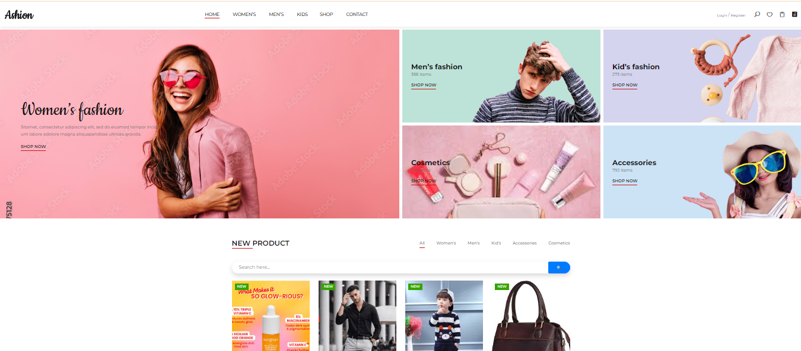

# 🛍️ Ashion - Fashion E-Commerce Website

A modern **Fashion E‑Commerce Web Application** where users can browse
fashion products, explore categories, and view trending collections with
a clean and responsive UI.

🌐 **Live Demo:**\
https://bridal-convert-cole-indicating.trycloudflare.com

------------------------------------------------------------------------

## 🚀 Features

-   🏠 Modern Home Page UI
-   👗 Women, Men & Kids Categories
-   🛒 Product Listing System
-   🔍 Shop & Browse Products
-   👤 Login & Register Pages
-   💄 Cosmetics & Accessories Section
-   📱 Fully Responsive Design
-   🎯 Trending & Featured Products

------------------------------------------------------------------------

## 🖼️ Project Screenshots

### Home Page



### Products Page


### Categories Section


------------------------------------------------------------------------

## 🧰 Tech Stack

-   **Frontend:** HTML, CSS, JavaScript
-   **UI Design:** Ashion Template
-   **Deployment:** Cloudflare Tunnel

------------------------------------------------------------------------

## 📂 Folder Structure

    project/
    │
    ├── index.html
    ├── css/
    ├── js/
    ├── img/
    └── screenshots/

------------------------------------------------------------------------

## ⚙️ Installation & Setup

1.  Clone the repository

``` bash
git clone https://github.com/yourusername/project-name.git
```

2.  Open project folder

``` bash
cd project-name
```

3.  Run project locally

Open `index.html` in your browser\
OR run using Live Server.

------------------------------------------------------------------------

## 🌐 Live Preview

This project is shared using Cloudflare Tunnel:

https://bridal-convert-cole-indicating.trycloudflare.com

------------------------------------------------------------------------

## 📈 Future Improvements

-   Add Cart Functionality
-   Payment Gateway Integration
-   User Dashboard
-   Admin Panel
-   Database Integration

------------------------------------------------------------------------

## 👨‍💻 Author

**Iti Khandelwal**

-   GitHub: https://github.com/yourusername
-   LinkedIn: Add your LinkedIn profile

------------------------------------------------------------------------

⭐ If you like this project, consider giving it a star!
